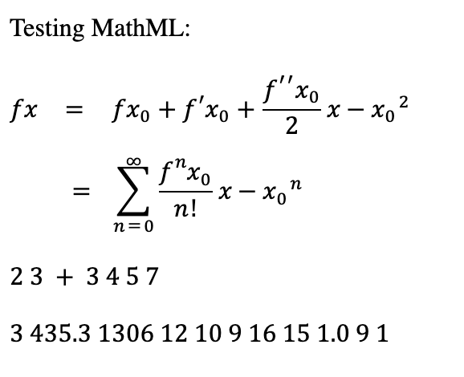

# Simple Test for MML3 Support

## MathJax Support

> MathJax supports the MathML3.0 mathematics tags, with some limitations. The MathML support is still under active development, so some tags are not yet implemented, and some features are not fully developed, but are coming.
> 
> The deficiencies include:
> - **No support for alignment groups in tables**.
> - **Not all attributes are supported for tables**. E.g., columnspan and rowspan are not implemented yet.
> - Experimental support for the elementary math tags: mstack, mlongdiv, msgroup, msrow, mscarries, and mscarry (**via the mml3 extension, only available for MatJax 2.7 for now**).
> - Experimental support for bidirectional mathematics (**via the mml3 extension, only available for MatJax 2.7 for now**).
> 
> See the results of the [MathML3.0 test suite](http://www.w3.org/Math/testsuite/results/tests.html) for details.
> 
> *from MathJax [official documents](http://docs.mathjax.org/en/latest/input/mathml.html#supported-mathml-tags)*

See in any browsers: [test-mathjax.html](test-mathjax.html)

## Browsers' Native Support

> - Chrome doesn't have any MathML native support.
> - Firefox has limited support for MathML, but most MML3 features not included.
> - Safari has limited support for MathML, but most MML3 features not included.

See in Firefox: [test.html](test.html)

See in Safari: [test.html](test.html)

